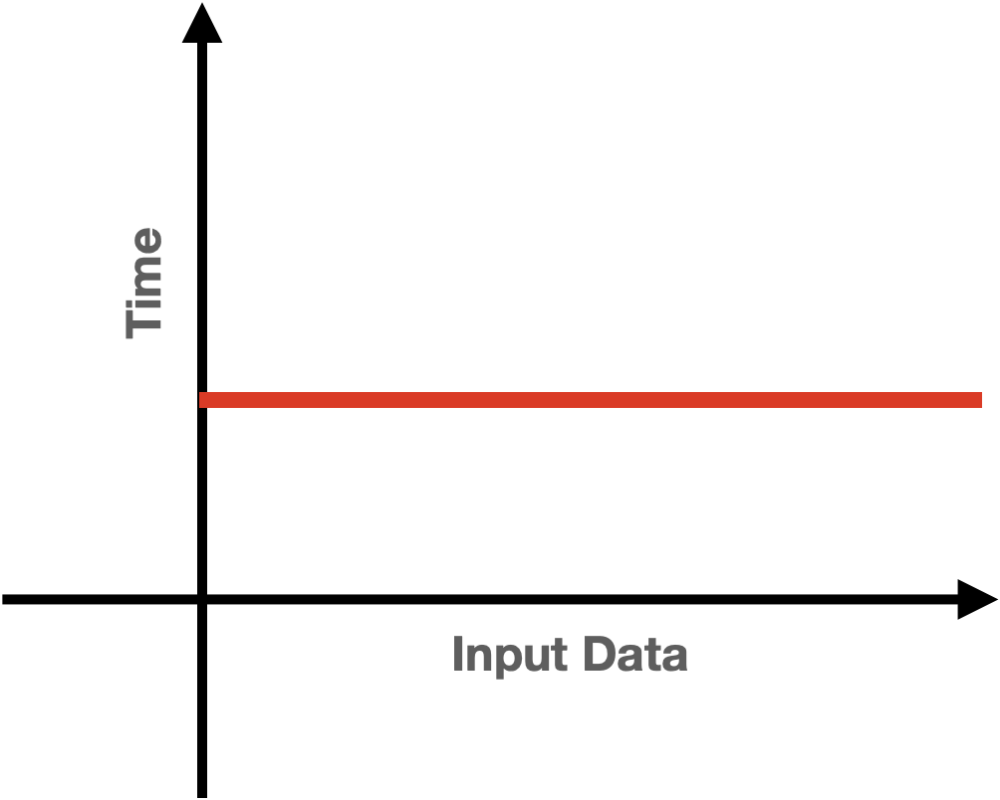
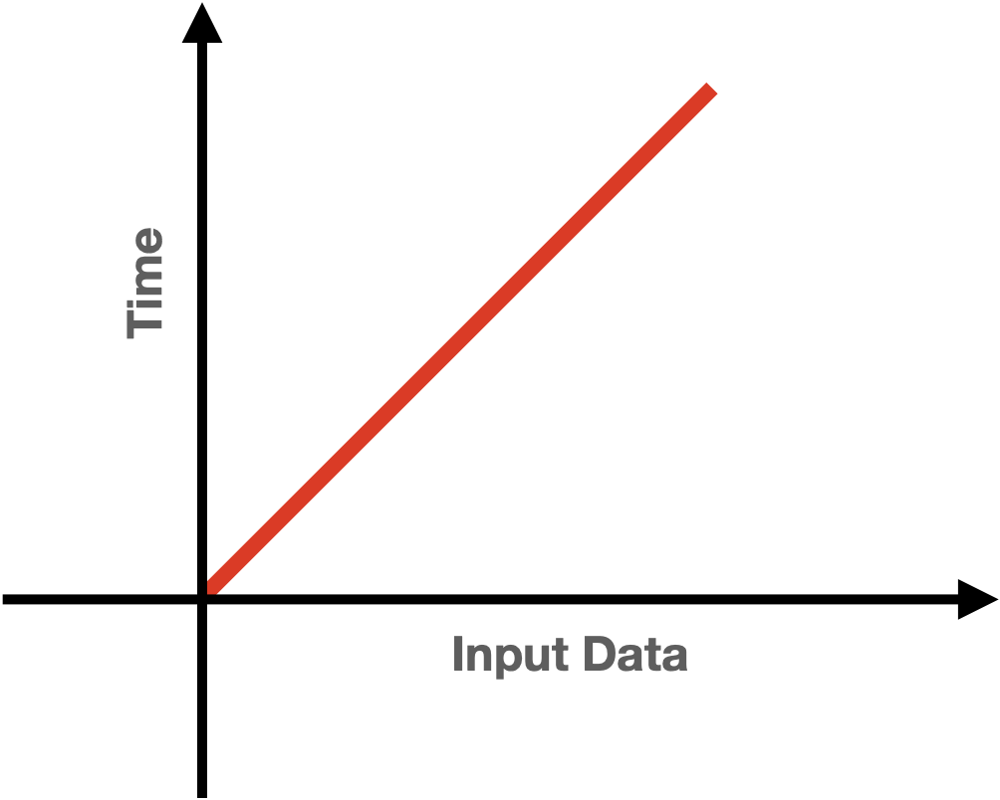
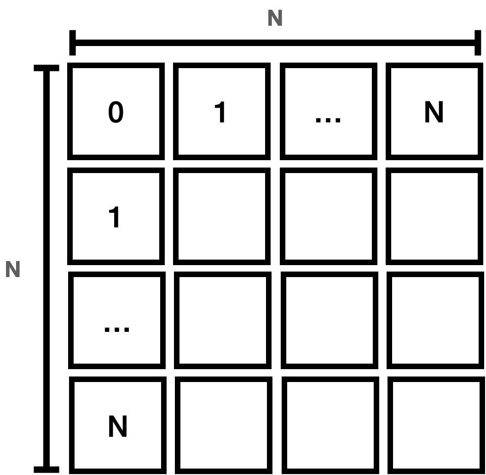
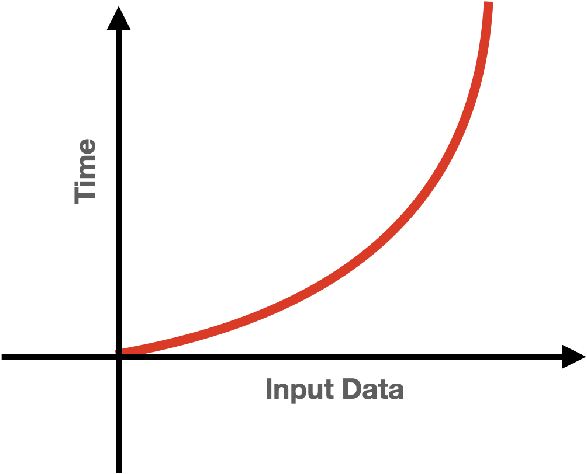
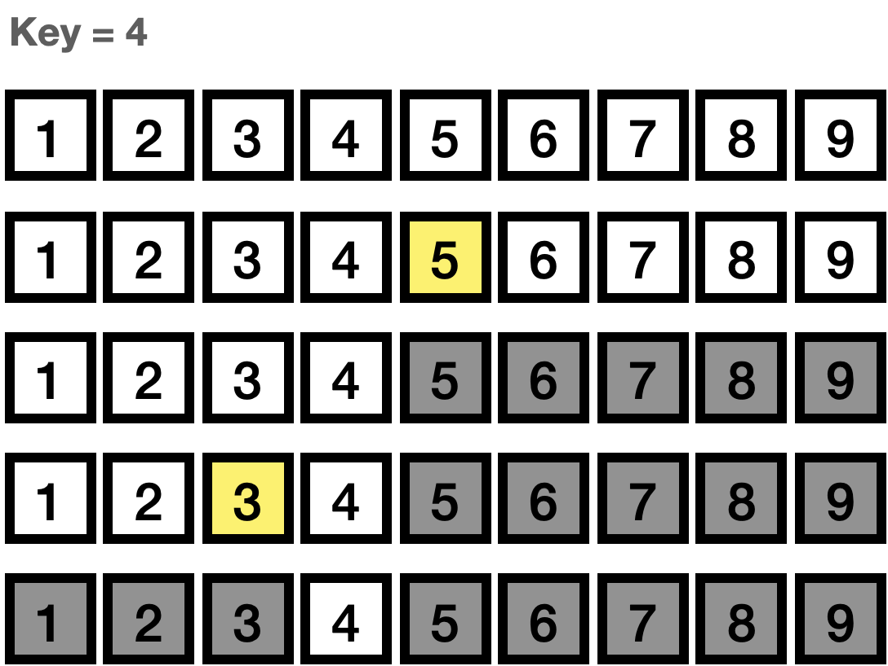
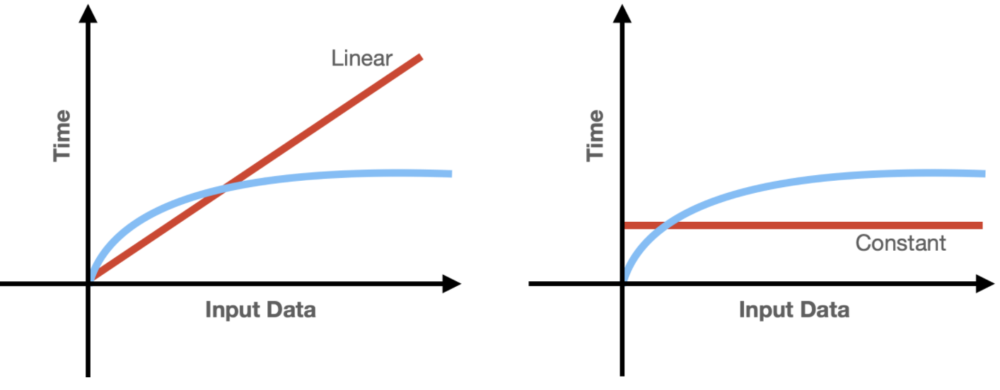

## Big-O 표기법

<br>
<br>
<br/>

[jhjo-tech : Big-O 표기법](https://jhjo-tech.tistory.com/manage/newpost/3?type=post&returnURL=https%3A%2F%2Fjhjo-tech.tistory.com%2F3)
<br>
<br>
<br/>
# Big-O 표기법

알고리즘을 시간(초단위)으로 표현을 하기에는 하드웨어에 따라서 더 빠를 수도 느릴 수도 있기 때문에 비교를 할 수가 없습니다. 그렇기 때문에 알고리즘의 성능을 수학적으로 표현하기 위한 표기법이 필요했고, 완료까지 걸리는 절차(STEPS)의 수를 속도로 보고 이를 Big-O 표기법을 사용해서 표기합니다.

예를 들어 Linear Search는 한 번에 하나씩 찾기 때문에 10개의 아이템이 있으면 10번의 스탭을 사용하고, 20개가 있으면 20번의 스탭을 거쳐야 찾을 수 있습니다. 이것은 입력되는 데이터의 사이즈 인 Input size가 N개이면 N번의 Step이 요구된다는 뜻이며, 그렇기 때문에 Linear Serarch의 시간 복잡도는 O(N)이 된다고 볼 수 있습니다.

이렇게 Big-O를 이해하면 알고리즘을 빠르게 이해하고 언제 무엇을 쓸지 파악이 가능하며 나의 코드의 성능을 예측해 볼 수 있습니다.
<br>
<br/>

# Constant time

```
int F(int n[])
{
    return (n[0] == 0) ? true : false;
}
```

위와 같은 함수는 Input data가 얼마나 큰지와는 관계없이 결과까지 항상 일정한 시간이 걸리게 되며 1번만 호출되기 때문에 O(1) - constant time이라고 할 수 있다.
<br>
<br/>

<center></center>
<div style="clear: both;"></div>

그렇다면 아래 함수의 경우에는 시간 복잡도를 어떻게 표기해야 할까요?

```
void F(int n[])
{
    cout << n[0] << endl;
    cout << n[0] << endl;
}
```

실제로 위에 함수를 끝내기 위해서는 O(2)만큼이 필요 하지만 Big-O는 함수의 디테일에는 관심이 없고 **Input size가 증가 또는 감소하는 상황에 대해서 함수가 어떻게 동작하는지에 대해서만 관심**이 있기 때문에 O(1)로 표기합니다.

예를 들어 Input size와는 관계없이 200개의 스탭이 필요한 함수가 있다면 시간 복잡도는 O(200)이 아니라 O(1)이 되어야 합니다.

다시 말해 인풋 사이즈에 관계없이 결과까지 일정한 시간을 가지는(constatnt time) 함수는 O(1)로 표기합니다.

constant time algorithm은 Input size에 관계없이 항상 스탭이 정해져 있기 때문에 가장 선호되는 알고리즘이지만 현실적으로 항상 동일하게 동작하게 하기에는 쉽지 않습니다.
<br>
<br/>

# Linear time

```
void F(int n[], int length)
{
    for (int i=0; i < length; i++)
    {
        cout << i << endl;
    }
}
```

위와 같은 함수는 배열의 사이즈가 10이면 10번을 돌고, 1000이면 1000번을 돌게 됩니다. 매번 배열의 아이템을 각각 돌면서 모두 작업을 해야 하며 배열이 커지게 되면 STEPS도 커지게 됩니다.

이렇게 Input size에 따라 선형적으로 처리 시간이 증가하게 되는 알고리즘의 Big-O는 O(N)이며 그래프는 다음과 같습니다.
<br>
<br/>

<center></center>
<div style="clear: both;"></div>

그렇다면 아래와 같은 함수에서 시간 복잡도는 어떻게 변하게 될까요?

```
void F(int n[], int length)
{
    for (int i=0; i < length; i++)
    {
        cout << i << endl;
    }
    
    for (int i=0; i < length; i++)
    {
        cout << i << endl;
    }
}
```

위에서 Big-O는 Input 사이즈와 관계없이 STEPS이 늘어나게 되면 1로 보기로 했다는 걸 다시 생각해야 합니다.

Big-O에서 핵심은 Input size의 변화에 따라 STEPS이 변하는 것을 표기한다는 것입니다.

그렇기 때문에 위의 함수의 Big-O는 O(2N)이 아니라 O(N)이 됩니다.
<br>
<br/>

# Quadratic time

O(n^2)을 가지는 2차 시간으로 Nested Loop에서 발생한다.

```
void F(int n[], int length)
{
    for (int i=0; i < length; i++)
    {
        for (int j=0; j < length; j++)
        {
            cout << n[i] + n[j] << endl;
        }
    }
}
```

위의 함수는 배열의 각 아이템에 대해서 루프를 반복하면서 실행한다.

이를 그림으로 표현하는 다음과 같은 면적을 가지게 된다.
<br>
<br/>

<center></center>
<div style="clear: both;"></div>

이 그림을 보면 10개를 완성하는 데에는 100번의 STEPS가 20개는 400번의 STEPS가 필요하게 된다는 걸 알 수 있다.

이를 그래프로 그리면 다음과 같다.
<br>
<br/>

<center></center>
<div style="clear: both;"></div>
<br>
<br/>

## Linear vs Quadratic

선형 시간과 2차 시간과 비교하면 Input size가 커질수록 선형 시간 복잡도가 더 효율적임을 알 수 있습니다.
<br>
<br/>

<center></center>
<div style="clear: both;"></div>


아래와 같이 n을 m만큼 돌아도 Quadratic time을 가지게 됩니다.

```
void F(int n[], int m[], int n_length, int m_length)
{
    for (int i=0; i < n_length; i++)
    {
        for (int j=0; j < m_length; j++)
        {
            cout << n[i] + m[j] << endl;
        }
    }
}
```

O(N^3)의 경우도 발생하는데, N^2과 비슷하지만 가로, 세로에 높이까지 곱해짐에 따라 O(N^2)와 같은 Input size로 비교하면 급격하게 시간이 오래 걸리게 됩니다.

```
void F(int n[], int length)
{
    for (int i=0; i < length; i++)
    {
        for (int j=0; j < length; j++)
        {
            for (int p=0; p < length; p++)
            {
                cout << n[i] + n[j] + n[p] << endl;
            }
        }
    }
}
```
<br>
<br/>

# Exponential time

```
int F(int n)
{
    if (n <= 1)
        return n;
    
    return F(n-1) + F(n-2);
}
```

Fibonacci number를 가지는 재귀함수가 있습니다.

재귀가 동작하는 과정을 트리로 나타내면 다음과 같습니다.

```
5 -- 4 -- 3 -- 2 -- 1
 |    |    |    |
 |    |    |     -- 0
 |    |     -- 1
 |     -- 2 -- 1
 |         |
 |          -- 0
  -- 3 -- 2 -- 1
      |    |
      |     -- 0
       -- 1
```

값을 구하기 위해서는 바로 전의 숫자와 전전의 숫자를 알아야 합니다. 매번 함수가 호출될 때마다 2번씩 호출하게 되고 이걸 트리의 높이만큼 구하게 됩니다.

이 과정은 O(2^N)의 시간 복잡도를 가지게 되며 그래프는 다음과 같습니다.
<br>
<br/>

<center></center>
<div style="clear: both;"></div>

Input size가 증가하게 되면 처리시간이 급격하게 증가하게 됩니다.
<br>
<br/>

# Logarithmic time

로그 시간은 Binary search와 같은 알고리즘을 설명할 때 사용됩니다.

이진 검색(Binary search)은 각 과정을 진행하면서 데이터를 절반씩 줄여가며 진행했기 때문에 Input size가 2배로 증가해도 전체적은 steps는 1만 증가하게 됩니다.

Binary search의 과정을 보면 다음과 같습니다.
<br>
<br/>

<center></center>
<div style="clear: both;"></div>

1.  정렬 안에서 가운데 값을 찾아 키값과 비교하고 키 값이 더 작으니 오른쪽에 있는 값들은 필요가 없습니다.
2.  가운데 값에서 왼쪽에 있는 값들 중 중간값을 찾아 키 값과 비교하니 키값이 더 크니 왼쪽 값은 안 봐도 됩니다.

이렇게 처리가 진행될 때마다 찾아야 하는 범위가 절반씩 줄어들게 되는 알고리즘을 O(log N)이라 합니다.

이를 코드로 보면 다음과 같습니다.

```
int F(int key, int arr[], int start, int end)
{
    if (start > end) return -1;
    int m = (start + end) / 2;
    if (arr[m] == key) return m;
    else if (arr[m] > key) return F(key, arr, start, m-1);
    else return F(key, arr, m+1, end);
}
```

처음 호출될 때는 시작이 0과 마지막 인덱스를 사용해 주어진 범위 내에서 중간값을 찾습니다. 중간값보다 작으면 중간값 바로 직전까지 범위를 조정하고, 크면 시작하는 위치를 중간값 다음으로 변경합니다.

함수가 호출될 때마다 범위가 절반씩 제거되기 때문에 O(log N)이 됩니다.

왜 절반씩 제거되는데 Log N이 되나면 Logarithm(로그)는 exponent(지수)를 다른 방식으로 표현한 식인데, 지수는 밑수를 몇번 곱해야 한다를 표현한 수로 예를 들어 2^n = 32이 있다면 2를 몇번 곱해야 32인지를 물어보는 말이며, 2를 5번 곱하면 32가 되기 때문에 n은 5로 2^5 = 32가 됩니다.

반면 n= log 2(32)는 32를 2로 몇 번을 나눠야 1이 나올까를 묻는 말로, 32를 2로 계속 나누면 총 5번이 된다는 걸 알 수 있고 32의 밑이 2인 로그는 5라는 것을 알 수 있습니다.

이 과정을 생각해 보면 binary search와 비슷하다는 것을 알 수 있습니다.

이진 검색에서는 input값을 일단 반으로 나눠서 시작하고 각 스텝마다 데이터를 반으로 나누게 됩니다. 이렇게 동작하기 때문에 input size가 2배가 되어도 스탭은 1개만 늘어나게 되고 Big-O로는 log(N)으로 쓸 수 있습니다. (참고로 Big-O에서는 base\_밑은 쓰지 않습니다)

O(log N)을 그래프로 보면 Linear Time보다는 빠르고 Constant Time 보다는 느리다는 것을 알 수 있습니다.
<br>
<br/>

<center></center>
<div style="clear: both;"></div>

이제 Big-O를 읽을수도 있고, 내가 만든 코드가 몇 번의 STEPS를 통해 얼마의 시간 복잡도를 가지게 되는지를 알 수 있게 되었습니다.
<br>
<br/>

# 요약

-   Big-O 표기법은 하드웨어에 따라 성능이 다르기 때문에 알고리즘만 수학적으로 표현하기 위해 사용하는 방식이다.
-   Drop Constants - Big-O에서 상수는 과감하게 버린다.
-   Constant time은 O(1)이다.
-   Linear time O(N)이다.
-   Quadratic Time은 O(N^2)이다.
-   Exponential Time은 (2^N)이다.
-   Logarithmic Time은 O(log N)이다.
-   가장 선호되는 건 Constant time이나, Log > Linear > Exponential으로 가면 알고리즘이 꽤나 복잡해진다고 볼 수 있다.
-   Big-O가 알고리즘 전체를 반영하지 못하는 경우도 있지만 알고리즘의 대략적인 성능을 유추해 볼 수 있다.
<br>
<br/>

## 참고

\- [https://ko.khanacademy.org/math/a2/x2ec2f6f830c9fb89:logs/x2ec2f6f830c9fb89:log-intro/a/intro-to-logarithms](https://ko.khanacademy.org/math/a2/x2ec2f6f830c9fb89:logs/x2ec2f6f830c9fb89:log-intro/a/intro-to-logarithms "칸아카데미 - 로그란?")

\- [https://www.youtube.com/watch?v=BEVnxbxBqi8](https://www.youtube.com/watch?v=BEVnxbxBqi8 "개발자라면 이제는 알아야하는 Big O 설명해드림. 10분컷.")

\- [https://www.youtube.com/watch?v=6Iq5iMCVsXA](https://www.youtube.com/watch?v=6Iq5iMCVsXA "[자료구조 알고리즘] 빅오(Big-O)표기법 완전정복")


